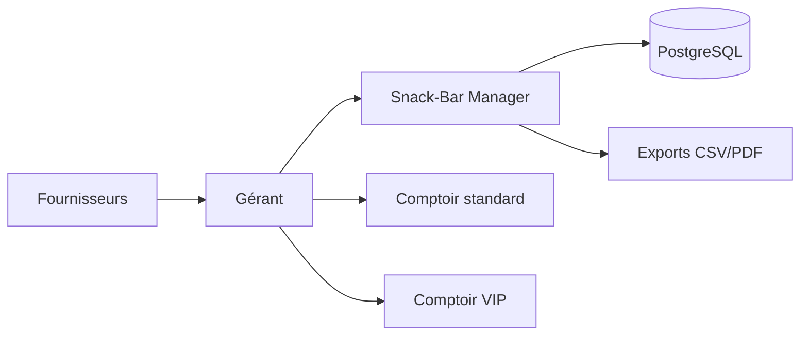
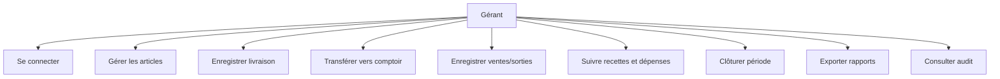
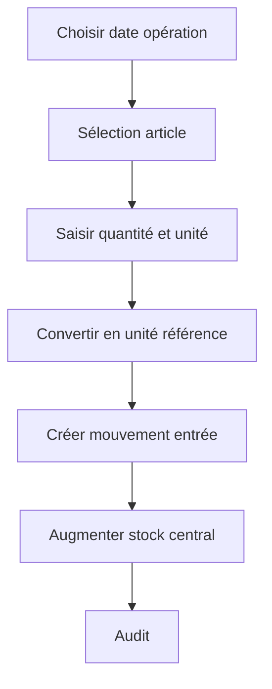
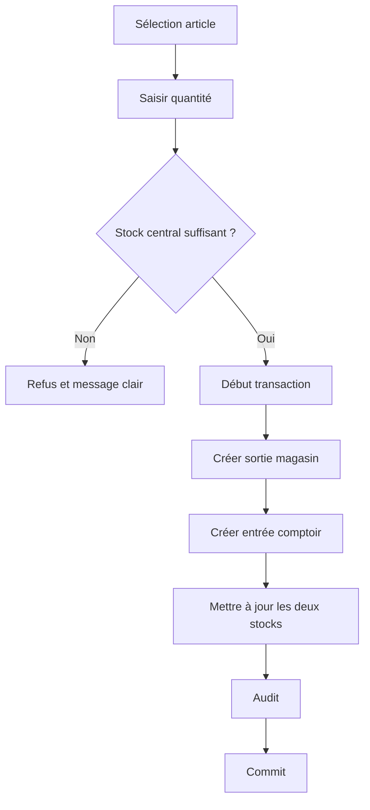
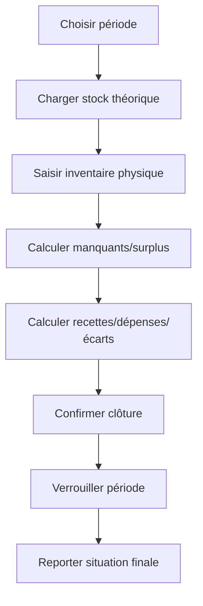
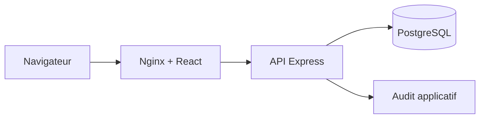

# Diagrammes

## Diagramme de contexte

```mermaid
flowchart LR
  Gerant[Gérant] --> App[Snack-Bar Manager]
  App --> DB[(PostgreSQL)]
  App --> Exports[Exports CSV/PDF]
  Fournisseur[Fournisseurs] --> Gerant
  Gerant --> ComptoirStandard[Comptoir standard]
  Gerant --> ComptoirVIP[Comptoir VIP]
```

## Cas d’utilisation

```mermaid
flowchart TB
  U[Gérant]
  U --> Auth[Se connecter]
  U --> Articles[Gérer les articles]
  U --> Livraison[Enregistrer livraison]
  U --> Transfert[Transférer vers comptoir]
  U --> Vente[Enregistrer ventes/sorties]
  U --> Finance[Suivre recettes et dépenses]
  U --> Cloture[Clôturer période]
  U --> Rapports[Exporter rapports]
  U --> Audit[Consulter audit]
```

## Activité livraison fournisseur

```mermaid
flowchart TD
  A[Choisir date opération] --> B[Sélection article]
  B --> C[Saisir quantité et unité]
  C --> D[Convertir en unité référence]
  D --> E[Créer mouvement entrée]
  E --> F[Augmenter stock central]
  F --> G[Audit]
```

## Activité transfert

```mermaid
flowchart TD
  A[Sélection article] --> B[Saisir quantité]
  B --> C{Stock central suffisant ?}
  C -- Non --> X[Refus et message clair]
  C -- Oui --> D[Début transaction]
  D --> E[Créer sortie magasin]
  E --> F[Créer entrée comptoir]
  F --> G[Mettre à jour les deux stocks]
  G --> H[Audit]
  H --> I[Commit]
```

## Activité clôture

```mermaid
flowchart TD
  A[Choisir période] --> B[Charger stock théorique]
  B --> C[Saisir inventaire physique]
  C --> D[Calculer manquants/surplus]
  D --> E[Calculer recettes/dépenses/écarts]
  E --> F[Confirmer clôture]
  F --> G[Verrouiller période]
  G --> H[Reporter situation finale]
```

## Déploiement

```mermaid
flowchart LR
  Browser[Navigateur] --> Front[Nginx + React]
  Front --> API[API Express]
  API --> PG[(PostgreSQL)]
  API --> Logs[Audit applicatif]
```
